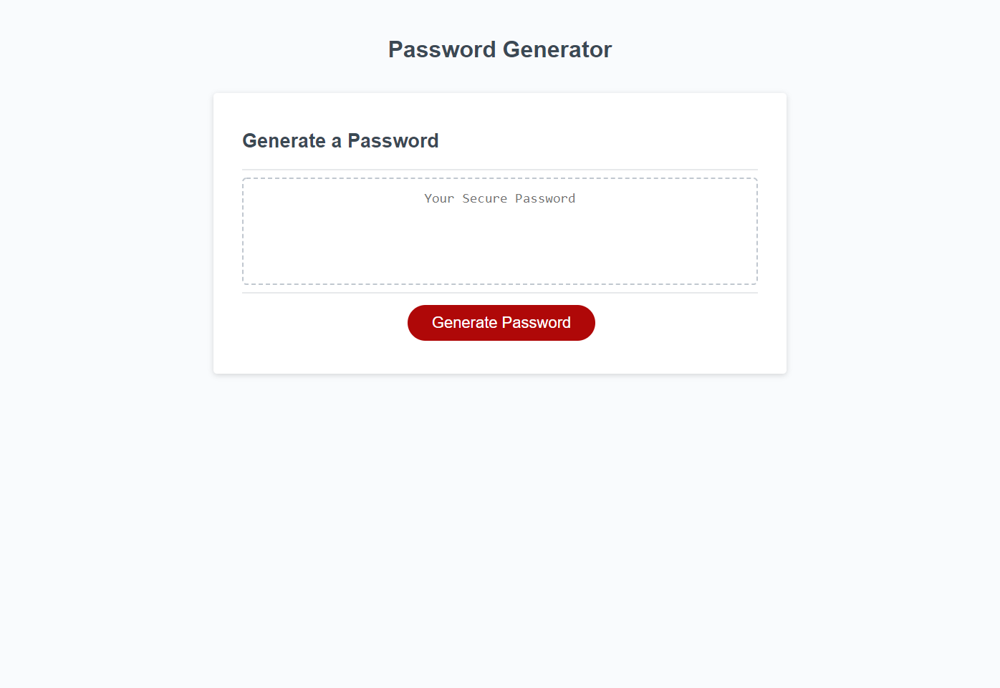

# Password Generator

Updates to JavaScript made by Jorge Garit.
This was created using the starter code provide to us for Challenge 3

## Function

When the generate password button is clicked window will prompt user with multiple options for a password between 8-138 characters. Options include: Number, Special Characters, Upper & Lower Case letters. 

Once the prompts are selected a password will generate. If button is clicked again a new password cna be generated using the new selected prompts

If no prompts are selected the code will create a random password using the lowercase array. 

### Deployed Application

Click [here](https://jorgegarit.github.io/password-generator/) to view the password generator

### Screenshot

#### Hope you enjoy this ReadMe and Happy July 4th! 🤓